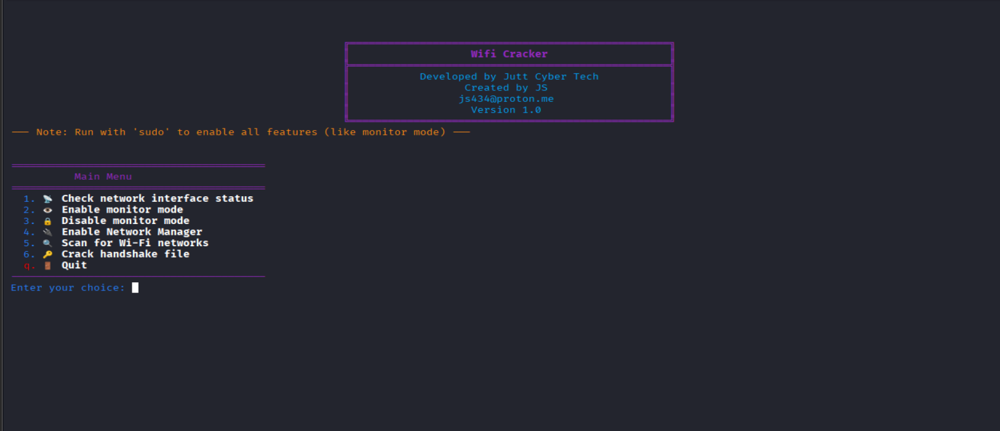

# 🚀 Wifi Cracker

A powerful Python-based Wi-Fi network scanner and security auditing tool for Linux.  
This tool provides a clean, menu-driven interface that wraps common `aircrack-ng` operations for easier, faster, and more accessible penetration testing.

Developed by **Jutt Cyber Tech**

---

## 📸 Screenshot

Below is a preview of the Wifi Cracker interface:

<p align="center">
  
</p>

---

## ⚠️ Disclaimer

This tool is **strictly for educational purposes** and for auditing **networks you own** or have **explicit written permission** to test.

Unauthorized scanning, cracking, or attacking Wi-Fi networks is **illegal**.  
The developer **assumes no responsibility** for any misuse or damage.

---

## 🔥 Features

### 🛠 Network Interface Management
- View all wireless interfaces and their modes (Managed / Monitor)
- Enable or disable monitor mode on any selected interface

### 📡 Wi-Fi Scanning
- Scan all nearby Wi-Fi networks using `airodump-ng`
- Select a target network from scan results

### 🎯 Targeted Actions
- Run focused scanning on a specific access point  
- View clients connected to the network  
- Perform deauthentication (deauth) attacks  
- Capture WPA/WPA2 handshake files automatically

### 🔓 Handshake Cracking
- Crack `.cap` files using:
  - `aircrack-ng` (CPU)
  - `hashcat` (GPU, recommended)
- Automatically detects common wordlists in `/usr/share/wordlists/`

### ⚙️ System Integration
- Start NetworkManager service directly from the script
- Works with standard Linux networking tools

---

## 📦 Requirements

### 🖥 System Requirements
- **OS**: Debian-based Linux (Kali Linux recommended)
- **Python**: Python 3.x
- **Permissions**: Must run with **sudo**

### 🔧 Software Dependencies
Install these tools before running:

- `wireless-tools`
- `net-tools`
- `aircrack-ng`
- `hashcat` (optional)

Install on Debian-based systems:

```sh
sudo apt-get update && sudo apt-get install -y wireless-tools net-tools aircrack-ng hashcat
```

---

## ▶️ How to Run

1. **Clone the repository**
    ```sh
    git clone https://github.com/juttcybertech/Wifi-Cracker.git
    ```

2. **Navigate into the directory**
    ```sh
    cd Wifi-Cracker
    ```

3. **Install required tools** (see above)

4. **Run the script**
    ```sh
    sudo python3 wificracker.py
    ```

5. **Follow the on-screen menu** to scan networks, capture handshakes, or start cracking.

---

## 🏁 Final Notes

This tool is designed to simplify Wi-Fi auditing and learning.  
Use responsibly. Stay ethical. Stay secure. 🔐
